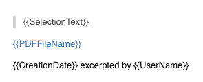

# Excerptor

Quickly take and locate excerpts in PDF files.

Support Preview / Skim (1.4.11) in OS X (>= 10.10, not test on 10.11)

Dependencies: [SIMBL](http://www.culater.net/software/SIMBL/SIMBL.php)

When you read a PDF file, you may want to take some excerpts, like excerpting on physical books (including article name, page number etc.). Via Excerptor, you can take excerpts easily: select text in Preview/[Skim](http://skim-app.sourceforge.net) and type a shortcut. An excerpt will be stored in pasteboard or a file. The excerpt includes a special link. By clicking the link, Excerptor will open the corresponding file by Preview/Skim, go to the page you want and highlight the excerpt you made, automatically.


## Features

### No lock-in format.

* Excerpt file format is plain text.
* Excerptor links contain all information to locate excerpts. It is possible to find your excerpts by following the information in an excerpt link itself.
A typical excerptor link is as follows (The part in square brackets may be repeated and delimited by "-").
  ```
  excerptor://FilePathOrDEVONthinkUUID:PercentEncodingExcerptText:[pPageNumber_ExcerptTextLocation_ExcerptTextLength]
  ```

### Fully customizable

Excerpts are generated by templates which can be set in Excerptor's preferences.


## DEVONthink Pro support

UUID in DEVONthink Pro can be used to locate PDF files if it is installed, otherwise file paths are used to locate files.

## QuickLook excerpt files

By default, excerpt files generated by Excerptor are [Markdown](http://daringfireball.net/projects/markdown/) plain text format.

With Brett Terpstra's MMD-QuickLook(https://github.com/ttscoff/MMD-QuickLook/), you can QuickLook excerpt files by typing space bar when a excerpt file is selected.



You can click an excerpt link in QuickLook views to open the corresponding PDF file and locate to your excerpt.

## Installation

See Wiki page [Excerptor Installation](https://github.com/guoc/excerptor/wiki/Excerptor-Installation)

## Bug report and feature request
are very welcome. Create an issue or email me guochen42+excerptor@gmail.com
